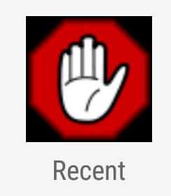
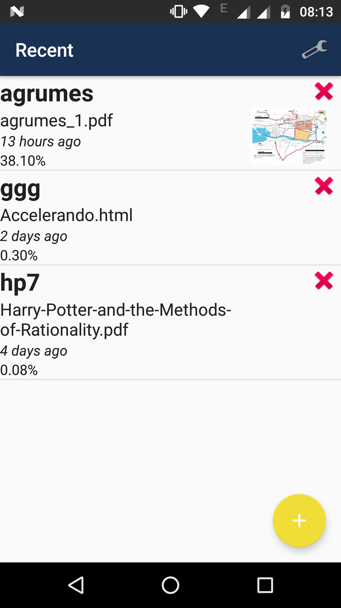

# FastRead
Simple app allowing to do some speed-reading on `PDF` and `HTML` pages. The speed-reading process assumes that most of the time spent while reading is dedicated to moving the eyes to the next word to read. The principle is thus to always display the word at the same place so that in theory we can save this time and read faster.

# Installation

The application was built with Android studio and is not yet available anywhere except here. To install it one should clone the project through git clone `git@github.com:Knoblauchpilze/ReadDesc.git` and then import it to the studio.

# Usage

The application defines three main views:
 * The recent reads view
 * The settings view
 * The reading view

## Recent reads

This activity keeps track of the reads already registered by the user and sort them on the last accessed date. The name of the read is displayed along with its thumbnail (if any) and the percentage of completion reached by the user. One can remove a read or select it for reading mode. The user can also create a read with the dedicated floating action button or access the settings.

## Settings

Allows to define the properties to use to render the application and to perform the reading mode. General settings such as the interval between two words, the color of the reading mode, etc. can be specified through this activity. All the settings are persisted through some preferences mechanism and are propagated throughout the application.
Going back from this activity saves the preferences and so does using the `save` icon. The user can choose to reset preferences to their default values.

## Reading view

This is the main view of the application. The data to read is loaded in an asynchronous manner and is then displayed one word at a time in the central text view. The user can control the reading (pause it, move to the next section, etc.) using the controls bar at the bottom of the view. Depending on the corresponding setting some context (i.e. the previous and next words) will also be displayed in the view.
The reading continues until a number of words specified in the settings has been reached. The action binded on the `Next` and `Previous` depends on the type of reading: in the case of a `PDF` this actually goes to the previous/next page while in the `HTML` case it goes to the next header as defined using the `h1-6` tags.

